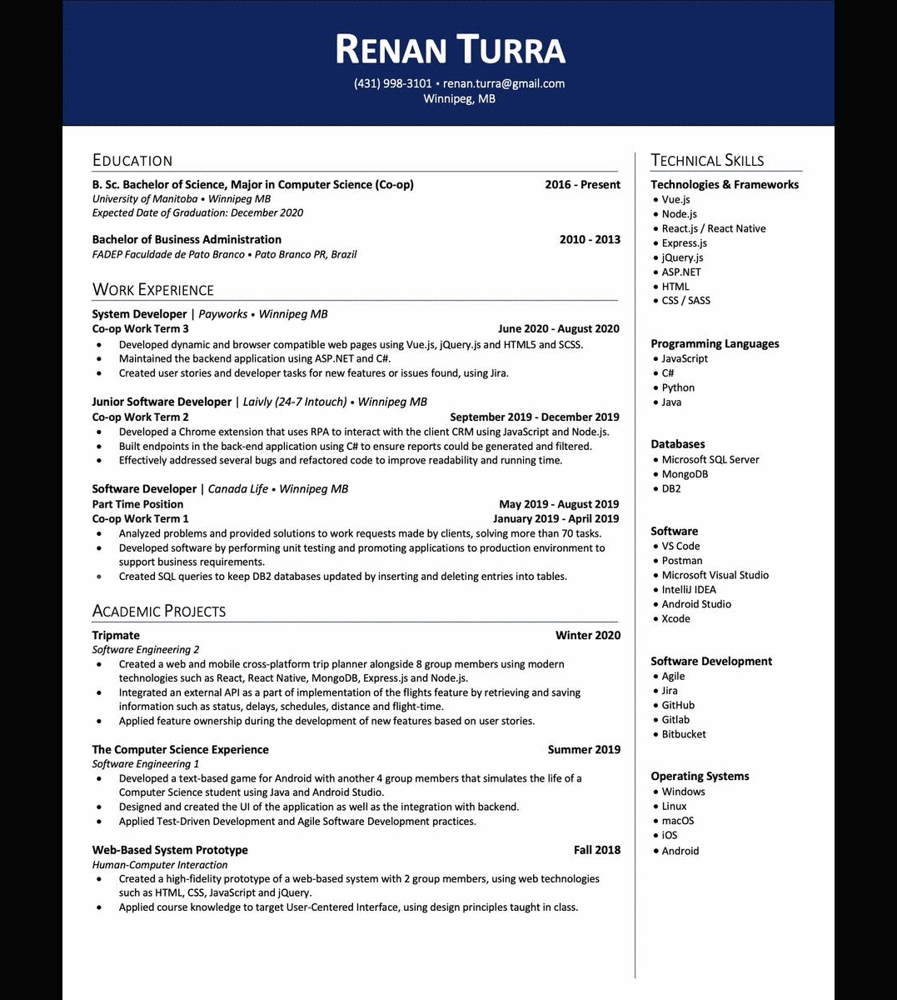

# Hosting a Resume on GitHub Pages

## Summary

[Intro](#Intro)  
[Prerequisites](#Prerequisites)  
[Instructions](#Instructions)  
[Authors and Acknowledgments](#Authors-and-Acknowledgments)  
[FAQ](#FAQ)

## Intro
The purpose of this README is to show how Computer Science students (or anyone that is interested) can create and host their resume on GitHub Pages. 

By the end of this tutorial, you will have your resume hosted by GitHub and you will be able to send it to potential employers.

> This tutorial follow the guidelines presented by Andrew Etter on his book _Modern Technical Writing_

## Prerequisites

The only prerequisite for hosting your resume on GitHub Pages is a resume formatted in markdown. If you are not familiar with markdown, you can learn more in the [more resources](#more-resources) section.  

## Instructions

The steps that you need to follow are very straightforward. First, we will take a look at an overview of the steps. Then, we will look at each step in more detail.  

1. Create GitHub account  
2. Create a new repository called _username.github.io_  
3. Create a file called `index.md` to your new repository, and add your resume to the file  
4. Select a theme for your new resume  

At the end of this steps, you will be able to access and share your website!  

### Steps
**1. Creating a GitHub account** 
To host a page on GitHub Pages, you will need a GitHub account. 
- Access [GitHub](https://github.com/) and sign up for a new account.  

Being a Distributed Version Control System, GitHub keeps track of all the diferent versions of the same file. This is a fundamental tool to modern software development, since we have hundreds of developers working together in the same project. To maintain control of all the concurrent changes that might happen, Etter affirms that the software and its documentation must be tightly integrated as it is very important to keep "documentation and code branches to stay in sync".  

**2. Create a new repository called _username.github.io_**  
Now that you have an account, we need to create your first repository. To do that, you should:  
- Click on the `+` sign at the top right of the page  
- Click on `New repository`  
- Under `Repository name`, add _username.github.io_, where _username_ will be your GitHub user  
- Click `Create repository` 

When you use the _username.github.io_ special naming, you are telling GitHub to create a static page using Jekyll. You can learn more about this tool by accessing [Jekyll website](https://jekyllrb.com).  

Static pages are a simple pages that will always be the same for everyone that access it. According to Etter, the advantages of static pages over dinamically generated pages are given since they "have no server-side application dependencies, no databases, and nothing to install, so migrating the entire site is as easy as moving a directory". To put it in another way, having a website using static pages means that you don't need to worry about all the complexity that hosting a website involves.  

**3. Create a file called `index.md` to your new repository, and add your resume to the file**  
Now that we have our repository, we need to create a new file. On your newly created repository:  
- Click `Add File` and select `Create new file`  
- Inside the input box that reads `Name your file...`, write `index.md`  
- Copy all the contents of your mardown formatted resume  
- Under `Edit new file`, paste the contents of your resume  
- Click `Commit new file` at the bottom of the page  

Your resume is already being hosted by GitHub Pages. You can access it already by opening your browser and typing _username.github.io_. Under the hood, when you create a file called `index.md`, GitHub understands that this is the main page of your static website. Then, it takes the markdown file (the `.md` extension) and converts to a website format. According to Etter, light markup languages are perfect to reduce the complexity of big files into something more accessible, that can be easily changed.  

**4. Select a theme for your new resume**  
Your resume hosted on GitHub Pages is already up and running, but we need to add some styling to it  
- In your repository, click on `Settings` on the upper tab  
- Scroll down to the section called `GitHub Pages`  
- Click on `Change theme`  
- Find the theme that best suits you and click `Select theme`  

Done! Now you have a shiny new resume hosted on GitHub Pages.  
In the following image, you can see how we went from PDF to raw markdown, to how our markdown looks like, and finally the website hosted on GitHub Pages.  

### More Resources
**1. Markdown tutorial:**  
If you have no previous experience with markdown, [Markdown Tutorial](https://www.markdowntutorial.com) can provide you a lot of information about this lightweight markup language.

**2. Modern Technical Writing:**  
To learn more about technical writing, you can check out [_Modern Technical Writing_](https://www.amazon.ca/Modern-Technical-Writing-Introduction-Documentation-ebook/dp/B01A2QL9SS) by Andrew Etter. This book introduces tools and techniques that will help you write better sofware documentation.

**3. StackEdit:**  
If you need a quick way to edit and visualize your markdown documents, you can access [StackEdit](https://stackedit.io/). This tool provides a great interface for users that are new to markdown, with real time preview of your text.

## Authors and Acknowledgments

**Author:** [Renan Desconsi Turra](https://renanturra.github.io)

**Template author:** [Steve Smith](https://github.com/orderedlist)  

**Reference:** [Modern Technical Writing, by Andrew Etter](https://www.amazon.ca/Modern-Technical-Writing-Introduction-Documentation-ebook/dp/B01A2QL9SS)

## FAQ

### 1. Why is markdown better than a word processor?  
With markdown you can have a smaller file that is easier read and shared by humans. Additionally, these files are also read and shared by computers. Word processors are great for other tasks, but we should avoid it when writing documentation (such as this README). As stated by Etter, the main advantage of markdown is the "the natural separation of content and style, of HTML and CSS" it provides. When we work with markdown, we only need to worry about the content, leaving the style for later. 

### 2. Why is my resume not showing up?  
There are a few issues that might happen when you try to host your resume. You should check the following things:
- Make sure your resume is properly formatted in markdown and named as `index.md`.
- Check if our respository was created correctly, using the _username.github.io_ format.
- Right after adding new files or even making changes to existing ones, GitHub takes sometime to compile and build those changes. If that is the case, you can try accessing your website again in a minute or two.